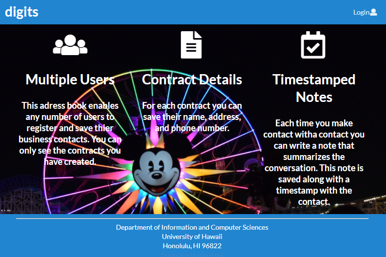

#Digits
#### Landing page

Digits is a web application that can be used to store and manage the user's contact information

### Installation
To set up Digits
1. First install Meteor
2. Download a copy of digits from the github repo
3. cd into the app directory of digits
4. install the required libraries using the command: ```$ meteor npm install ```
5. run the application by using the command ```$ meteor npm run start ``` You should now be able to find you application at [http://localhost:3000/](http://localhost:3000/).

### Login/Signup

You can use the icon at the top right of the application to access the login or register pages. If you don't have a saved account create one, otherwise login.

### Add Contact

Through the add contact page you are able to add new contacts to your stored list.

### List Contacts

List contacts shows all the contacts you have stored. You may also add time stamped notes under each contact.

### Edit Contact

By selecting edit under one of the contact cards you can access the edit contact page. From here you may change any of the contact's details.

### Admin

If you signed in with the admin account you can view all of the stored contacts from all of the users.
